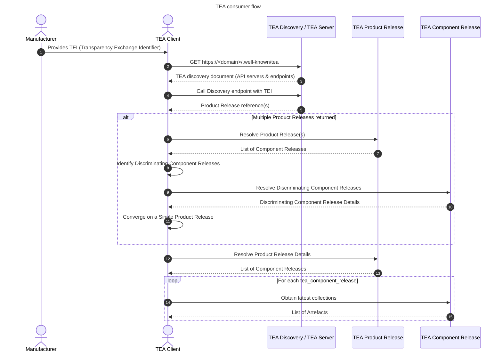
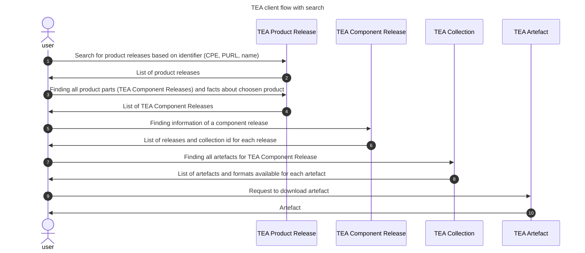
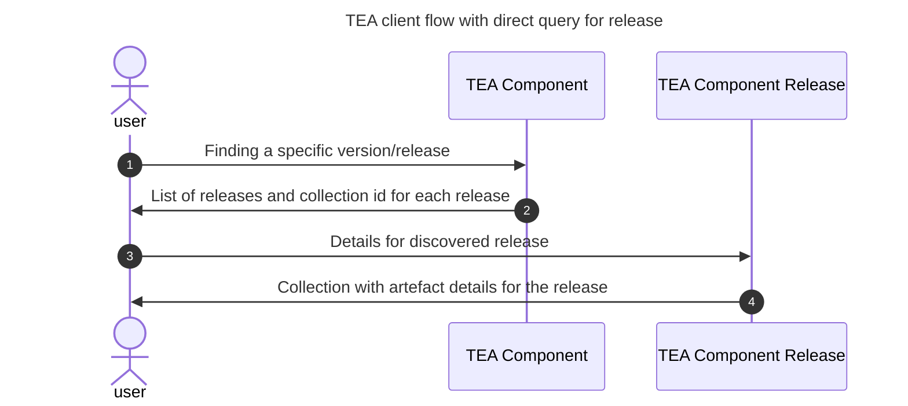
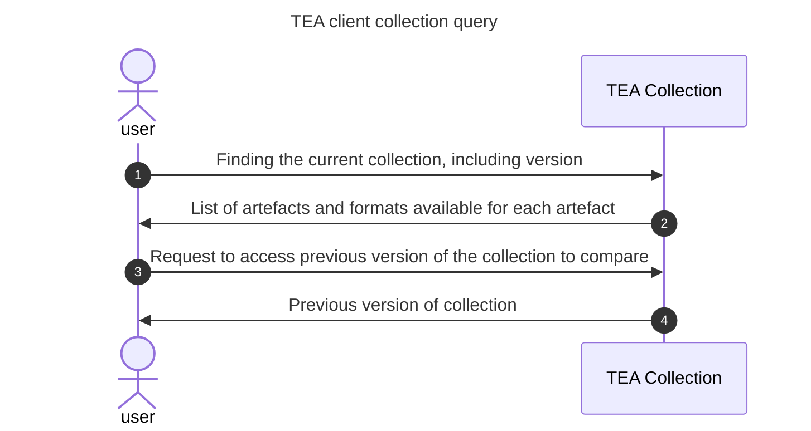

# Transparency Exchange API: Consumer access

The consumer access starts with a TEI, A transparency Exchange Identifier. This is used to find the API server as
described in the [discovery document](/discovery/readme.md).

## API usage

The standard TEI points to a product release. A product release is something sold, downloaded as an opensource project or aquired by other means. It contains one or multiple component releases.

- __List of TEA Component Rleases__: Component releases are components of a product release.
  Each Component release has its own versioning and its own set of artefacts, they have a timestamp and   a lifecycle enumeration. They are normally sorted by timestamps. The TEA API has no requirements of type of version string (semantic or any other scheme) - it's just an identifier set by the manufacturer.
- __List of TEA Collections__: For each release, there is a list of TEA collections as indicated
  by release date and a version integer starting with collection version 1. 
- __List of TEA Artefacts__: The collection is unique for a version and contains a list of artefacts.
  This can be SBOM files, VEX, SCITT, IN-TOTO or other documents.  Note that a single artefact
  can belong to multiple Component or Product Releases.
- __List of artefact formats__: An artefact can be published in multiple formats.

The user has to know product release TEI and in some cases version of each component (TEA 
Component Release) to find the list of artefacts for the particular Product Release.

## API flow based on TEI discovery

## API flow based on direct access to API

In this case, the client wants to search for a specific product release using the API

## API flow based on cached data - checking for a new release

In this case a TEA client knows the component UUID and wants to check the status of the
used release and if there's a new release. The client may limit the query with a given date
for a release.

## API flow based on cached data  - checking if a collection changed

In this case a TEA client knows the release UUID, the collection UUID, and the
collection version from previous queries. If the given version is not the same,
another query is done to get reason for update and new collection list of artefacts.

