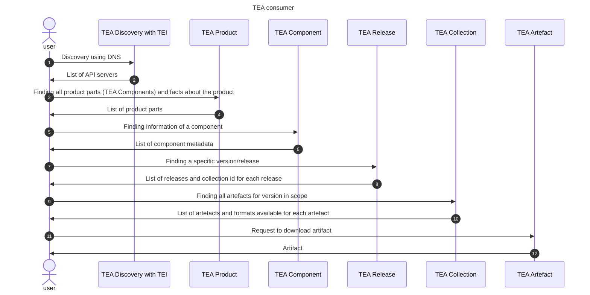
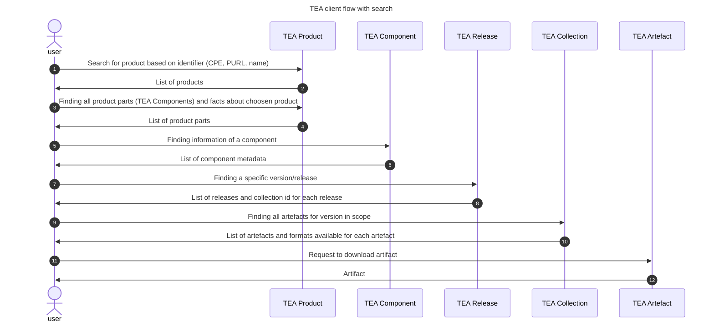

# Transparency Exchange API: Consumer access

The consumer access starts with a TEI, A transparency Exchange Identifier. This is used to find the API server as
described in the [discovery document](/discovery/readme.md).

## API usage

The standard TEI points to a product. A product is something sold, downloaded as an opensource project or aquired
by other means. It contains one or multiple components.

- __List of TEA Components__: Components are components of something that is part of a product.
  Each Component has it's own versioning and it's own set of artifacts.
- __List of TEA releases__: Each component has a list of releases where each release has a timestamp and
  a lifecycle enumeration. They are normally sorted by timestamps. The TEA API has no requirements of
type of version string (semantic or any other scheme) - it's just an identifier set by the manufacturer.
- __List of TEA collections__: For each release, there is a list of TEA collections as indicated
  by release date and a version integer starting with collection version 1. 
- __List of TEA artifacts__: The collection is unique for a version and contains a list of artifacts.
  This can be SBOM files, VEX, SCITT, IN-TOTO or other documents.  Note that a single artifact
  can belong to multiple versionsof a Component and multiple Components.
- __List of artifact formats__: An artifact can be published in multiple formats.

The user has to know product TEI and version of each component (TEA Component) to find the list of
artifacts for the used version.

## API flow based on TEI discovery

## API flow based on direct access to API

In this case, the client wants to search for a specific product using the API

