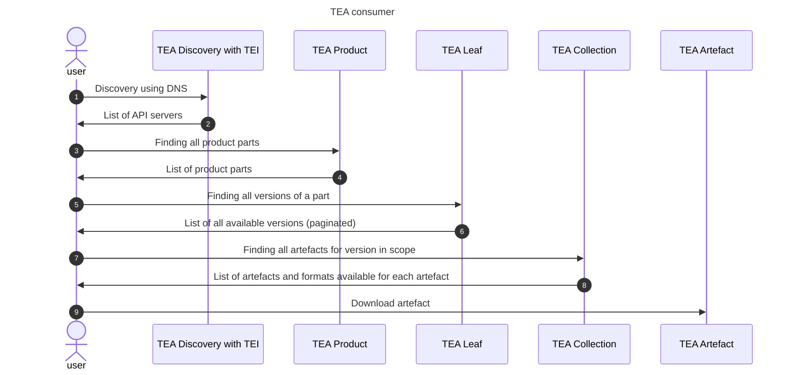

# Transparency Exchange API: Consumer access

The consumer access starts with a TEI, A transparency Exchange Identifier. This is used to find the API server as
described in the [discovery document](/discovery/readme.md).

## API usage

The standard TEI points to a product.

- __List of TEA leafs__: Leafs are components of something sold. Each leaf has it's own versioning and it's own set of artefacts. Note that a single artefact can belong to multiple versions of a leaf and multiple leafs.
- __List of TEA collections__: For each leaf, there is a list of TEA collections as indicated by release date and a version string. The TEA API has no requirements of type of version string (semantic or any other scheme) - it's just an identifier set by the manufacturer. It's sorted by release date as a default.
- __List of TEA artefacts__: The collection is unique for a version and contains a list of artefacts. This can be SBOM files, VEX, SCITT, IN-TOTO or other documents.
- __List of artefact formats__: An artefact can be published in multiple formats.

The user has to know product TEI and version of each component (TEA LEAF) to find the list of artefacts for the used version.

## API flow

