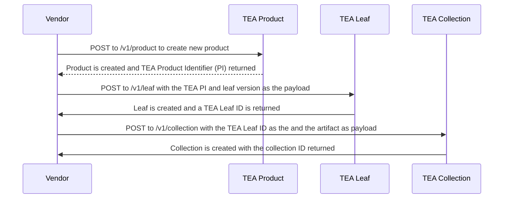
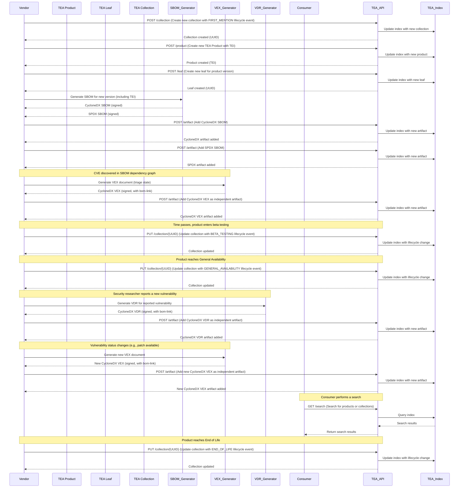

# Overview of the TEA API from a producer standpoint

* Note: Suggestion, input for the group

## Bootstrapping

```mermaid
sequenceDiagram
    participant Vendor
    participant TEA Product
    participant TEA Leaf
    participant TEA Collection

    Vendor ->> TEA Product: POST to /v1/product to create new product
    TEA Product -->> Vendor: Product is created and TEA Product Identifier (PI) returned

    Vendor ->> TEA Leaf: POST to /v1/leaf with the TEA PI and leaf version as the payload
    TEA Leaf ->> Vendor: Leaf is created and a TEA Leaf ID is returned

    Vendor ->> TEA Collection: POST to /v1/collection with the TEA Leaf ID as the and the artifact as payload
    TEA Collection ->> Vendor: Collection is created with the collection ID returned

```

## Adding a new artifact

```mermaid
sequenceDiagram
    participant Vendor

    participant TEA Product
    participant TEA Leaf
    participant TEA Collection

    participant SBOM_Generator
    participant VEX_Generator
    participant VDR_Generator

    participant Consumer


    Vendor->>TEA_API: POST /collection (Create new collection with FIRST_MENTION lifecycle event)
    TEA_API->>TEA_Index: Update index with new collection
    TEA_API-->>Vendor: Collection created (UUID)

    Vendor->>TEA_API: POST /product (Create new TEA Product with TEI)
    TEA_API->>TEA_Index: Update index with new product
    TEA_API-->>Vendor: Product created (TEI)

    Vendor->>TEA_API: POST /leaf (Create new leaf for product version)
    TEA_API->>TEA_Index: Update index with new leaf
    TEA_API-->>Vendor: Leaf created (UUID)

    Vendor->>SBOM_Generator: Generate SBOM for new version (including TEI)
    SBOM_Generator-->>Vendor: CycloneDX SBOM (signed)
    SBOM_Generator-->>Vendor: SPDX SBOM (signed)

    Vendor->>TEA_API: POST /artifact (Add CycloneDX SBOM)
    TEA_API->>TEA_Index: Update index with new artifact
    TEA_API-->>Vendor: CycloneDX artifact added

    Vendor->>TEA_API: POST /artifact (Add SPDX SBOM)
    TEA_API->>TEA_Index: Update index with new artifact
    TEA_API-->>Vendor: SPDX artifact added

    Note over Vendor,VEX_Generator: CVE discovered in SBOM dependency graph

    Vendor->>VEX_Generator: Generate VEX document (triage state)
    VEX_Generator-->>Vendor: CycloneDX VEX (signed, with bom-link)

    Vendor->>TEA_API: POST /artifact (Add CycloneDX VEX as independent artifact)
    TEA_API->>TEA_Index: Update index with new artifact
    TEA_API-->>Vendor: CycloneDX VEX artifact added

    Note over Vendor,TEA_API: Time passes, product enters beta testing

    Vendor->>TEA_API: PUT /collection/{UUID} (Update collection with BETA_TESTING lifecycle event)
    TEA_API->>TEA_Index: Update index with lifecycle change
    TEA_API-->>Vendor: Collection updated

    Note over Vendor,TEA_API: Product reaches General Availability

    Vendor->>TEA_API: PUT /collection/{UUID} (Update collection with GENERAL_AVAILABILITY lifecycle event)
    TEA_API->>TEA_Index: Update index with lifecycle change
    TEA_API-->>Vendor: Collection updated

    Note over Vendor,VDR_Generator: Security researcher reports a new vulnerability

    Vendor->>VDR_Generator: Generate VDR for reported vulnerability
    VDR_Generator-->>Vendor: CycloneDX VDR (signed, with bom-link)

    Vendor->>TEA_API: POST /artifact (Add CycloneDX VDR as independent artifact)
    TEA_API->>TEA_Index: Update index with new artifact
    TEA_API-->>Vendor: CycloneDX VDR artifact added

    Note over Vendor,VEX_Generator: Vulnerability status changes (e.g., patch available)

    Vendor->>VEX_Generator: Generate new VEX document
    VEX_Generator-->>Vendor: New CycloneDX VEX (signed, with bom-link)

    Vendor->>TEA_API: POST /artifact (Add new CycloneDX VEX as independent artifact)
    TEA_API->>TEA_Index: Update index with new artifact
    TEA_API-->>Vendor: New CycloneDX VEX artifact added

    Note over Consumer,TEA_API: Consumer performs a search

    Consumer->>TEA_API: GET /search (Search for products or collections)
    TEA_API->>TEA_Index: Query index
    TEA_Index-->>TEA_API: Search results
    TEA_API-->>Consumer: Return search results

    Note over Vendor,TEA_API: Product reaches End of Life

    Vendor->>TEA_API: PUT /collection/{UUID} (Update collection with END_OF_LIFE lifecycle event)
    TEA_API->>TEA_Index: Update index with lifecycle change
    TEA_API-->>Vendor: Collection updated

```