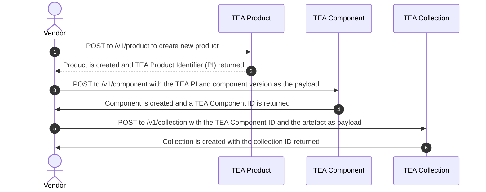
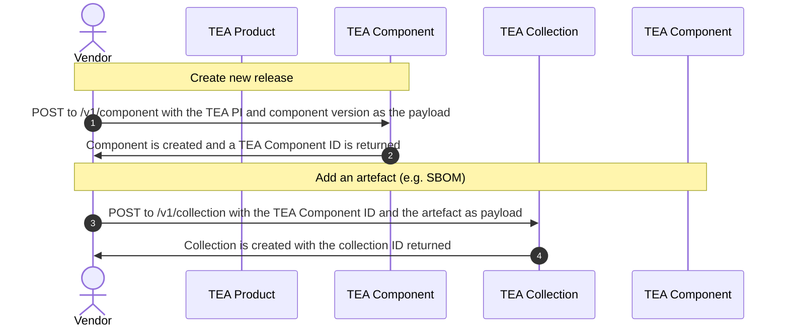
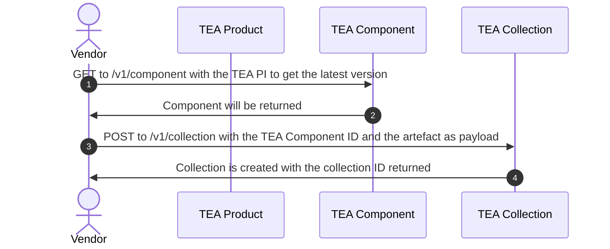

# Overview of the TEA API from a producer standpoint

This is input for the working group.

## Bootstrapping

```mermaid

sequenceDiagram
    autonumber
    actor Vendor
    participant tea_product as TEA Product
    participant tea_component as TEA Component
    participant tea_collection as TEA Collection

    Vendor ->> tea_product: POST to /v1/product to create new product
    tea_product -->> Vendor: Product is created and TEA Product Identifier (PI) returned

    Vendor ->> tea_component: POST to /v1/component with the TEA PI and component version as the payload
    tea_component ->> Vendor: Component is created and a TEA Component ID is returned

    Vendor ->> tea_collection: POST to /v1/collection with the TEA Component ID and the artefact as payload
    tea_collection ->> Vendor: Collection is created with the collection ID returned

```

## Release life cycle

```mermaid
sequenceDiagram
    autonumber
    actor Vendor
    participant tea_product as TEA Product
    participant tea_component as TEA Component
    participant tea_collection as TEA Collection

    Note over Vendor,tea_component: Create new release

    Vendor ->> tea_component: POST to /v1/component with the TEA PI and component version as the payload
    tea_component ->> Vendor: Component is created and a TEA Component ID is returned

    Note over Vendor,TEA Component: Add an artefact (e.g. SBOM)
    Vendor ->> tea_collection: POST to /v1/collection with the TEA Component ID and the artefact as payload
    tea_collection ->> Vendor: Collection is created with the collection ID returned

```

## Adding a new artefact

```mermaid
sequenceDiagram
    autonumber
    actor Vendor
    participant tea_product as TEA Product
    participant tea_component as TEA Component
    participant tea_collection as TEA Collection

    Vendor ->> tea_component: GET to /v1/component with the TEA PI to get the latest version
    tea_component ->> Vendor: Component will be returned

    Vendor ->> tea_collection: POST to /v1/collection with the TEA Component ID and the artefact as payload
    tea_collection ->> Vendor: Collection is created with the collection ID returned
```