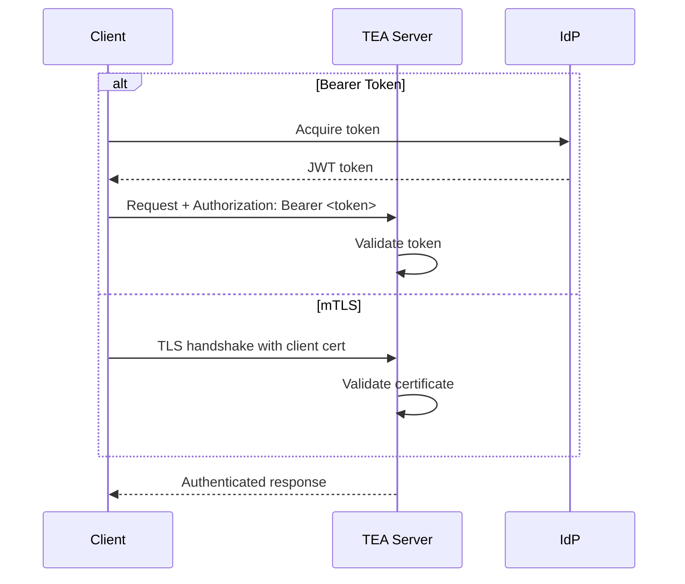

# Authentication

The Transparency Exchange API (TEA) supports two primary authentication mechanisms: Bearer Token authentication and Mutual TLS (mTLS) authentication. Implementations MUST support at least one of these mechanisms, and SHOULD support both for maximum compatibility.

## Bearer Token Authentication

Bearer token authentication uses JSON Web Tokens (JWTs) issued by an external identity provider. This is the recommended authentication mechanism for most use cases.

### Token Acquisition

Tokens are acquired out-of-band from the TEA server. The exact process depends on the service provider's identity management system, but typically involves:

1. User or service authenticates with the provider's portal or API
2. Provider issues a short-lived JWT (recommended: < 1 hour)
3. Client includes the token in API requests

### Token Format

Tokens MUST be valid JWTs conforming to RFC 7519. The token payload SHOULD include:

- `iss`: Issuer identifier
- `sub`: Subject (user or service identifier)
- `aud`: Audience (TEA server identifier)
- `exp`: Expiration time
- `iat`: Issued at time
- `scope`: Space-separated list of authorized scopes

### Request Format

Include the token in the `Authorization` header:

```
Authorization: Bearer <token>
```

### Token Validation

Servers MUST validate:

- Token signature using the issuer's public key
- Token expiration (`exp` claim)
- Token audience (`aud` claim)
- Required scopes for the operation

## Mutual TLS Authentication

Mutual TLS authentication uses client certificates for mutual authentication between client and server.

### Certificate Requirements

- Client certificates MUST use ECDSA P-384 or Ed25519 algorithms
- Certificates MUST be issued by a trusted Certificate Authority (CA)
- Certificate Subject Alternative Name (SAN) MUST include the client identifier

### TLS Configuration

- Minimum TLS version: 1.3
- Server MUST request client certificates
- Server MUST validate certificate chain
- Client MUST present valid certificate

### Authorization Mapping

The client certificate's subject or SAN is mapped to TEA identities and scopes through server-side configuration.

## Authentication Flow



## Error Responses

- `401 Unauthorized`: Missing or invalid credentials
- `403 Forbidden`: Valid credentials but insufficient permissions

## Security Considerations

- Tokens SHOULD be short-lived (< 1 hour)
- mTLS certificates SHOULD have short validity periods
- Implement token revocation mechanisms
- Log authentication failures for security monitoring
