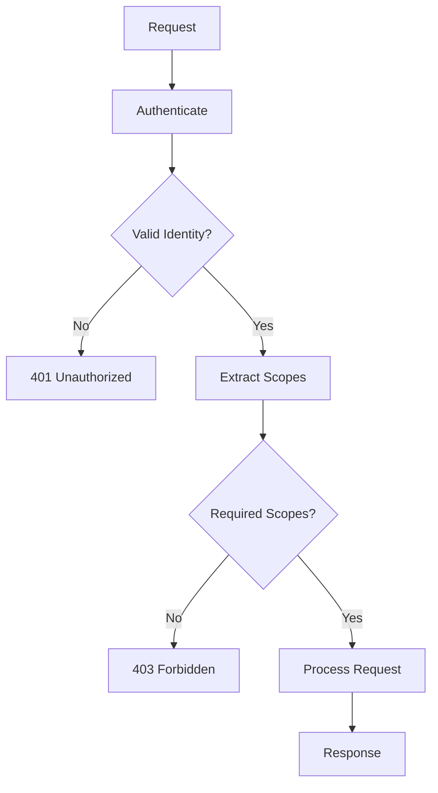

# Authorization

The Transparency Exchange API (TEA) uses a scope-based authorization model. Permissions are granted through scopes assigned to authenticated identities. Scopes follow a hierarchical structure with read operations generally requiring fewer permissions than write operations.

## Scope Model

Scopes are granted to identities during authentication. Bearer tokens include scopes in the `scope` claim as a space-separated list. mTLS certificates are mapped to scopes through server configuration.

### Scope Hierarchy

```
SCOPE_ADMIN_FULL (admin)
├── SCOPE_PUBLISHER_* (publisher)
│   ├── SCOPE_PUBLISHER_PRODUCTS_WRITE
│   ├── SCOPE_PUBLISHER_COMPONENTS_WRITE
│   ├── SCOPE_PUBLISHER_RELEASES_WRITE
│   ├── SCOPE_PUBLISHER_ARTIFACTS_WRITE
│   └── SCOPE_PUBLISHER_COLLECTIONS_WRITE
└── SCOPE_CONSUMER_* (consumer)
    ├── SCOPE_CONSUMER_PRODUCTS_READ
    ├── SCOPE_CONSUMER_COMPONENTS_READ
    ├── SCOPE_CONSUMER_COLLECTIONS_READ
    ├── SCOPE_CONSUMER_ARTIFACTS_READ
    ├── SCOPE_CONSUMER_ARTIFACTS_DOWNLOAD
    └── SCOPE_CONSUMER_INSIGHTS_QUERY
```

## Consumer Scopes

### Read Operations

- `SCOPE_CONSUMER_PRODUCTS_READ`: List and retrieve product metadata
- `SCOPE_CONSUMER_COMPONENTS_READ`: List and retrieve component metadata
- `SCOPE_CONSUMER_COLLECTIONS_READ`: Access collection metadata and versions
- `SCOPE_CONSUMER_ARTIFACTS_READ`: Retrieve artifact metadata
- `SCOPE_CONSUMER_ARTIFACTS_DOWNLOAD`: Download artifact content
- `SCOPE_CONSUMER_INSIGHTS_QUERY`: Execute CEL-based queries and searches

## Publisher Scopes

### Write Operations

- `SCOPE_PUBLISHER_PRODUCTS_WRITE`: Create, update, delete products
- `SCOPE_PUBLISHER_COMPONENTS_WRITE`: Create, update, delete components
- `SCOPE_PUBLISHER_RELEASES_WRITE`: Create, update product/component releases
- `SCOPE_PUBLISHER_ARTIFACTS_WRITE`: Upload and delete artifacts
- `SCOPE_PUBLISHER_COLLECTIONS_WRITE`: Create and update collections

## Admin Scopes

### Administrative Operations

- `SCOPE_ADMIN_FULL`: Full administrative access including user management, system configuration, and audit functions

## Authorization Logic

### API Endpoint Requirements

| Endpoint                      | Required Scopes                     |
| ----------------------------- | ----------------------------------- |
| `GET /.well-known/tea`        | None (public)                       |
| `GET /v1/discovery`           | None (public)                       |
| `GET /v1/products*`           | `SCOPE_CONSUMER_PRODUCTS_READ`      |
| `GET /v1/components*`         | `SCOPE_CONSUMER_COMPONENTS_READ`    |
| `GET /v1/collections*`        | `SCOPE_CONSUMER_COLLECTIONS_READ`   |
| `GET /v1/artifacts*`          | `SCOPE_CONSUMER_ARTIFACTS_READ`     |
| `GET /v1/artifacts/*/content` | `SCOPE_CONSUMER_ARTIFACTS_DOWNLOAD` |
| `POST /v1/insights/*`         | `SCOPE_CONSUMER_INSIGHTS_QUERY`     |
| `POST /v1/publisher/*`        | Publisher scopes as above           |

### Scope Validation

Servers MUST validate that the authenticated identity possesses all required scopes for the requested operation. Missing scopes result in `403 Forbidden` responses.

### Scope Granularity

Scopes are intentionally coarse-grained to simplify implementation. Fine-grained access control (e.g., per-object permissions) is not supported in the base specification but may be implemented as extensions.

## Authorization Flow



## Security Considerations

- Implement least privilege: grant only necessary scopes
- Regularly rotate credentials and review scope assignments
- Audit authorization decisions for compliance
- Consider scope expiration for temporary access
