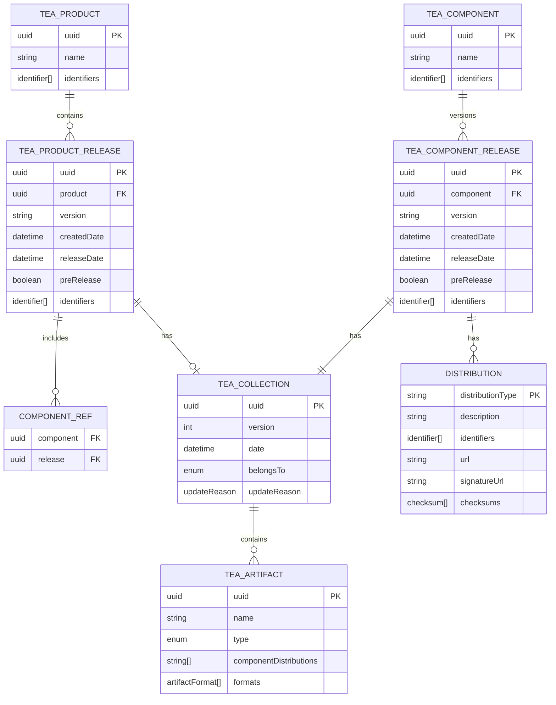
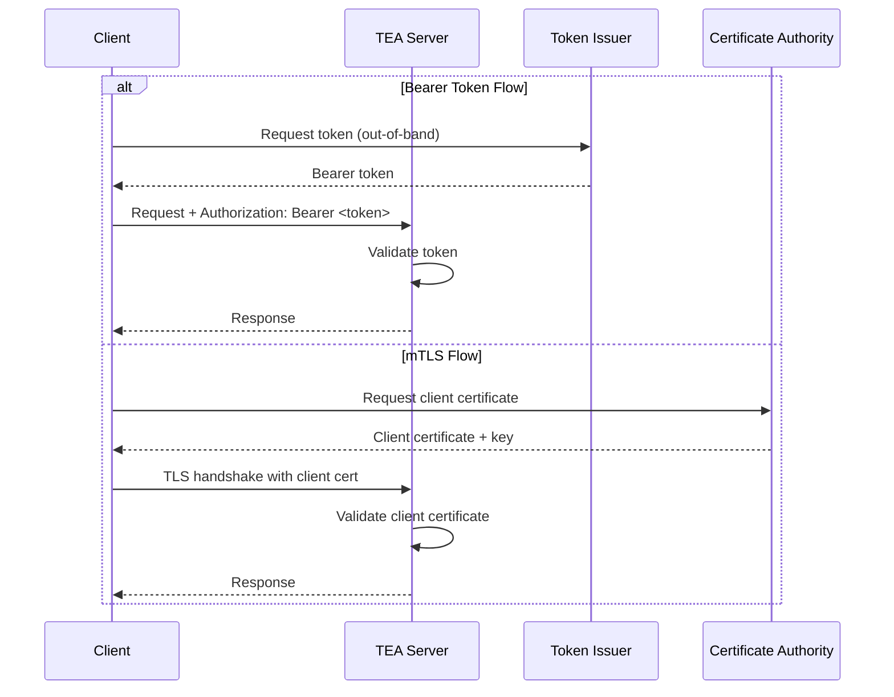
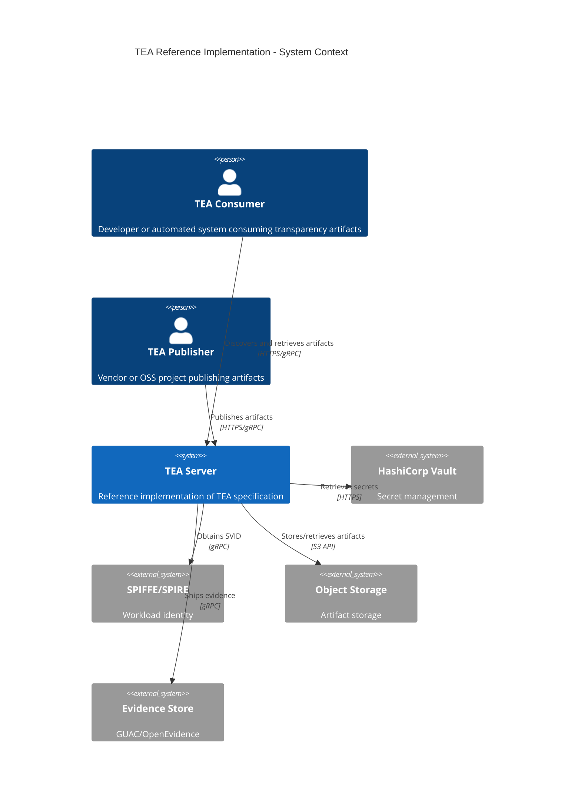
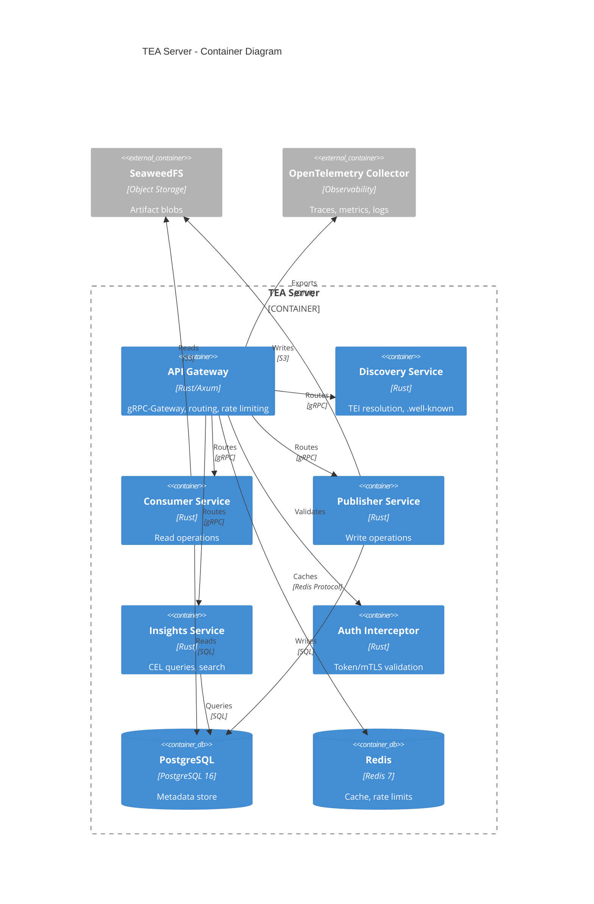
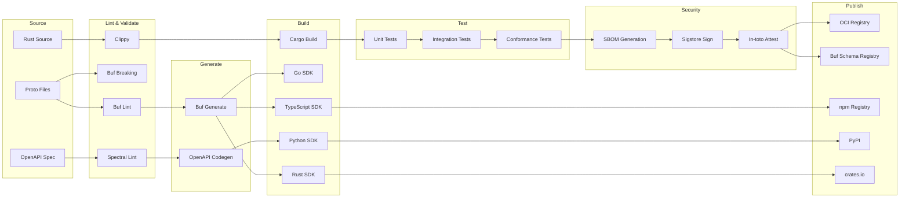
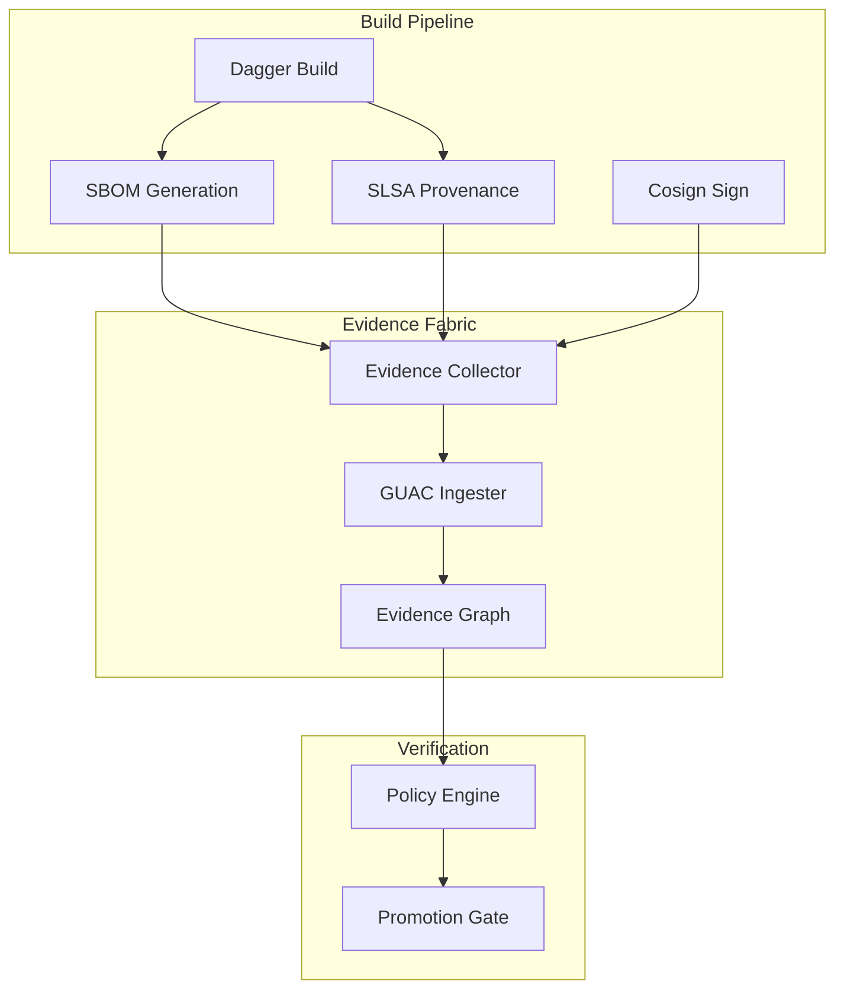
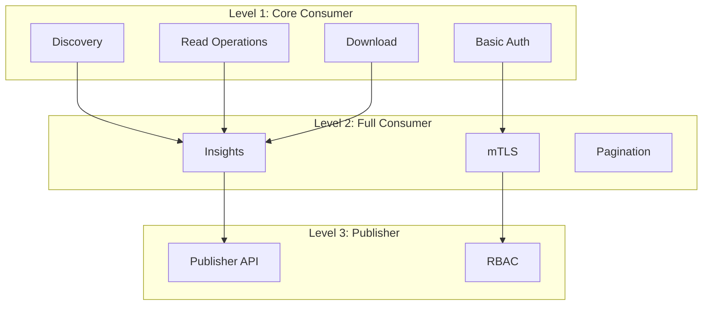

# TEA Specification Completion & Implementation Plan

## Executive Summary

This document provides a comprehensive plan for completing the CycloneDX Transparency Exchange API (TEA) specification and implementing a production-grade reference implementation. TEA is being standardized through ECMA TC54-TG1, currently at **Beta 2** status, focused on the consumer-side API.

---

## Part 1: Specification Gap Analysis

### 1.1 Current State Assessment

#### What Exists
| Artifact | Status | Location |
|----------|--------|----------|
| TEI URN Scheme | Defined | [`discovery/readme.md`](discovery/readme.md) |
| `.well-known/tea` Schema | JSON Schema v1 | [`discovery/tea-well-known.schema.json`](discovery/tea-well-known.schema.json) |
| TEA Product Model | Documented | [`tea-product/tea-product.md`](tea-product/tea-product.md) |
| TEA Product Release Model | Documented | [`tea-product/tea-product-release.md`](tea-product/tea-product-release.md) |
| TEA Component Model | Documented | [`tea-component/tea-component.md`](tea-component/tea-component.md) |
| TEA Release Model | Documented | [`tea-component/tea-release.md`](tea-component/tea-release.md) |
| TEA Collection Model | Documented | [`tea-collection/tea-collection.md`](tea-collection/tea-collection.md) |
| TEA Artifact Model | Documented | [`tea-artifact/tea-artifact.md`](tea-artifact/tea-artifact.md) |
| Authentication Guidance | High-level | [`auth/README.md`](auth/README.md) |
| Requirements | Defined | [`doc/tea-requirements.md`](doc/tea-requirements.md) |
| Use Cases | Defined | [`doc/tea-usecases.md`](doc/tea-usecases.md) |

#### Critical Gaps
1. **No OpenAPI Specification** - The consumer API lacks a formal OpenAPI 3.1 definition
2. **No Protobuf/gRPC Definitions** - No machine-readable contracts for gRPC-first architecture
3. **No JSON Schemas** - Data models exist as markdown examples only
4. **No Publisher API** - Deferred to post-1.0, but structure needed
5. **Incomplete Auth Flows** - Bearer token and mTLS mentioned but not specified
6. **No Insights/Query API** - CEL-based query capability mentioned but undefined
7. **No CLE Integration** - Common Lifecycle Enumeration not yet integrated
8. **Port Resolution Undefined** - DNS/port discovery incomplete

### 1.2 Beta 3 Priorities (from README)
- Refinement of distribution types and `distributionType` fields
- CLE Spec integration
- E2E POC of authn/z workflow
- Compliance document workflow

---

## Part 2: Data Model Schema Design

### 2.1 Core Domain Entities



### 2.2 Enumeration Types

```protobuf
// Identifier types for TEI, PURL, CPE
enum IdentifierType {
  IDENTIFIER_TYPE_UNSPECIFIED = 0;
  IDENTIFIER_TYPE_TEI = 1;
  IDENTIFIER_TYPE_PURL = 2;
  IDENTIFIER_TYPE_CPE = 3;
}

// Artifact types
enum ArtifactType {
  ARTIFACT_TYPE_UNSPECIFIED = 0;
  ARTIFACT_TYPE_ATTESTATION = 1;
  ARTIFACT_TYPE_BOM = 2;
  ARTIFACT_TYPE_BUILD_META = 3;
  ARTIFACT_TYPE_CERTIFICATION = 4;
  ARTIFACT_TYPE_FORMULATION = 5;
  ARTIFACT_TYPE_LICENSE = 6;
  ARTIFACT_TYPE_RELEASE_NOTES = 7;
  ARTIFACT_TYPE_SECURITY_TXT = 8;
  ARTIFACT_TYPE_THREAT_MODEL = 9;
  ARTIFACT_TYPE_VULNERABILITIES = 10;
  ARTIFACT_TYPE_OTHER = 99;
}

// Checksum algorithms
enum ChecksumAlgorithm {
  CHECKSUM_ALGORITHM_UNSPECIFIED = 0;
  CHECKSUM_ALGORITHM_MD5 = 1;       // Legacy, not recommended
  CHECKSUM_ALGORITHM_SHA1 = 2;      // Legacy, not recommended
  CHECKSUM_ALGORITHM_SHA256 = 3;
  CHECKSUM_ALGORITHM_SHA384 = 4;
  CHECKSUM_ALGORITHM_SHA512 = 5;
  CHECKSUM_ALGORITHM_SHA3_256 = 6;
  CHECKSUM_ALGORITHM_SHA3_384 = 7;
  CHECKSUM_ALGORITHM_SHA3_512 = 8;
  CHECKSUM_ALGORITHM_BLAKE2B_256 = 9;
  CHECKSUM_ALGORITHM_BLAKE2B_384 = 10;
  CHECKSUM_ALGORITHM_BLAKE2B_512 = 11;
  CHECKSUM_ALGORITHM_BLAKE3 = 12;
}

// Collection update reasons
enum UpdateReasonType {
  UPDATE_REASON_TYPE_UNSPECIFIED = 0;
  UPDATE_REASON_TYPE_INITIAL_RELEASE = 1;
  UPDATE_REASON_TYPE_VEX_UPDATED = 2;
  UPDATE_REASON_TYPE_ARTIFACT_UPDATED = 3;
  UPDATE_REASON_TYPE_ARTIFACT_REMOVED = 4;
  UPDATE_REASON_TYPE_ARTIFACT_ADDED = 5;
}

// Collection scope
enum CollectionScope {
  COLLECTION_SCOPE_UNSPECIFIED = 0;
  COLLECTION_SCOPE_RELEASE = 1;
  COLLECTION_SCOPE_PRODUCT_RELEASE = 2;
}
```

### 2.3 JSON Schema Structure

```
schemas/
├── common/
│   ├── identifier.schema.json
│   ├── checksum.schema.json
│   ├── pagination.schema.json
│   └── error.schema.json
├── discovery/
│   ├── tea-well-known.schema.json (exists)
│   └── discovery-response.schema.json
├── product/
│   ├── product.schema.json
│   ├── product-release.schema.json
│   └── component-ref.schema.json
├── component/
│   ├── component.schema.json
│   ├── component-release.schema.json
│   └── distribution.schema.json
├── collection/
│   ├── collection.schema.json
│   └── update-reason.schema.json
└── artifact/
    ├── artifact.schema.json
    └── artifact-format.schema.json
```

---

## Part 3: OpenAPI 3.1 Specification Design

### 3.1 API Structure Overview

```mermaid
flowchart TB
    subgraph Discovery
        WK[/.well-known/tea]
        DISC[/v1/discovery]
    end
    
    subgraph Consumer API
        subgraph Products
            P_LIST[GET /products]
            P_GET[GET /products/uuid]
            P_REL[GET /products/uuid/releases]
            PR_GET[GET /product-releases/uuid]
        end
        
        subgraph Components
            C_LIST[GET /components]
            C_GET[GET /components/uuid]
            C_REL[GET /components/uuid/releases]
            CR_GET[GET /component-releases/uuid]
        end
        
        subgraph Collections
            COL_GET[GET /collections/uuid]
            COL_VER[GET /collections/uuid/versions/v]
        end
        
        subgraph Artifacts
            ART_GET[GET /artifacts/uuid]
            ART_DL[GET /artifacts/uuid/download]
        end
        
        subgraph Insights
            INS_Q[POST /insights/query]
            INS_VULN[GET /insights/vulnerabilities]
        end
    end
    
    subgraph Publisher API
        PUB_PROD[POST /publisher/products]
        PUB_COMP[POST /publisher/components]
        PUB_REL[POST /publisher/releases]
        PUB_ART[POST /publisher/artifacts]
        PUB_COL[POST /publisher/collections]
    end
    
    WK --> DISC
    DISC --> P_GET
    DISC --> PR_GET
    P_GET --> P_REL
    PR_GET --> COL_GET
    C_GET --> C_REL
    CR_GET --> COL_GET
    COL_GET --> ART_GET
    ART_GET --> ART_DL
```

### 3.2 Consumer API Endpoints

| Method | Path | Description | Auth |
|--------|------|-------------|------|
| `GET` | `/.well-known/tea` | Discovery document | Public |
| `GET` | `/v1/discovery` | Resolve TEI to product release | Optional |
| `GET` | `/v1/products` | List products | Optional |
| `GET` | `/v1/products/{uuid}` | Get product by UUID | Optional |
| `GET` | `/v1/products/{uuid}/releases` | List releases for product | Optional |
| `GET` | `/v1/product-releases/{uuid}` | Get product release | Optional |
| `GET` | `/v1/product-releases/{uuid}/collection` | Get collection for product release | Optional |
| `GET` | `/v1/components` | List components | Optional |
| `GET` | `/v1/components/{uuid}` | Get component by UUID | Optional |
| `GET` | `/v1/components/{uuid}/releases` | List releases for component | Optional |
| `GET` | `/v1/component-releases/{uuid}` | Get component release | Optional |
| `GET` | `/v1/component-releases/{uuid}/collection` | Get collection for release | Optional |
| `GET` | `/v1/collections/{uuid}` | Get latest collection version | Optional |
| `GET` | `/v1/collections/{uuid}/versions` | List collection versions | Optional |
| `GET` | `/v1/collections/{uuid}/versions/{version}` | Get specific collection version | Optional |
| `GET` | `/v1/artifacts/{uuid}` | Get artifact metadata | Optional |
| `GET` | `/v1/artifacts/{uuid}/content` | Download artifact content | Optional |
| `HEAD` | `/v1/artifacts/{uuid}/content` | Check artifact update (ETag) | Optional |
| `POST` | `/v1/insights/query` | CEL-based query | Required |
| `GET` | `/v1/insights/search` | Search artifacts by identifier | Optional |

### 3.3 Publisher API Endpoints

| Method | Path | Description | Auth |
|--------|------|-------------|------|
| `POST` | `/v1/publisher/products` | Create product | Required |
| `PUT` | `/v1/publisher/products/{uuid}` | Update product | Required |
| `DELETE` | `/v1/publisher/products/{uuid}` | Delete product | Required |
| `POST` | `/v1/publisher/product-releases` | Create product release | Required |
| `PUT` | `/v1/publisher/product-releases/{uuid}` | Update product release | Required |
| `POST` | `/v1/publisher/components` | Create component | Required |
| `PUT` | `/v1/publisher/components/{uuid}` | Update component | Required |
| `DELETE` | `/v1/publisher/components/{uuid}` | Delete component | Required |
| `POST` | `/v1/publisher/component-releases` | Create component release | Required |
| `PUT` | `/v1/publisher/component-releases/{uuid}` | Update component release | Required |
| `POST` | `/v1/publisher/artifacts` | Upload artifact | Required |
| `DELETE` | `/v1/publisher/artifacts/{uuid}` | Delete artifact | Required |
| `POST` | `/v1/publisher/collections` | Create/update collection | Required |

### 3.4 OpenAPI File Structure

```
spec/
├── openapi/
│   ├── tea-consumer.openapi.yaml      # Main consumer spec
│   ├── tea-publisher.openapi.yaml     # Publisher spec
│   ├── tea-combined.openapi.yaml      # Combined for full servers
│   ├── paths/
│   │   ├── discovery.yaml
│   │   ├── products.yaml
│   │   ├── components.yaml
│   │   ├── collections.yaml
│   │   ├── artifacts.yaml
│   │   ├── insights.yaml
│   │   └── publisher.yaml
│   ├── components/
│   │   ├── schemas/
│   │   │   └── ... (references ../../../schemas/)
│   │   ├── parameters/
│   │   │   ├── pagination.yaml
│   │   │   ├── uuid.yaml
│   │   │   └── tei.yaml
│   │   ├── responses/
│   │   │   ├── errors.yaml
│   │   │   └── pagination.yaml
│   │   └── securitySchemes/
│   │       ├── bearerAuth.yaml
│   │       └── mtls.yaml
│   └── examples/
│       └── ...
```

---

## Part 4: Protobuf/gRPC Specification Design

### 4.1 Buf V2 Project Structure

```
proto/
├── buf.yaml                    # Buf module configuration
├── buf.gen.yaml                # Code generation configuration
├── buf.lock                    # Dependency lock file
├── tea/
│   ├── v1/
│   │   ├── common.proto        # Common types
│   │   ├── discovery.proto     # Discovery service
│   │   ├── product.proto       # Product types
│   │   ├── component.proto     # Component types
│   │   ├── collection.proto    # Collection types
│   │   ├── artifact.proto      # Artifact types
│   │   ├── consumer.proto      # Consumer service
│   │   ├── publisher.proto     # Publisher service
│   │   └── insights.proto      # Insights/query service
│   └── v1beta1/                # Beta features
│       └── cle.proto           # CLE integration
```

### 4.2 Service Definitions

```protobuf
syntax = "proto3";

package tea.v1;

import "google/api/annotations.proto";
import "google/protobuf/timestamp.proto";
import "tea/v1/common.proto";
import "tea/v1/product.proto";
import "tea/v1/component.proto";
import "tea/v1/collection.proto";
import "tea/v1/artifact.proto";

// TEA Discovery Service
service DiscoveryService {
  // Resolve a TEI to a product release
  rpc Discover(DiscoverRequest) returns (DiscoverResponse) {
    option (google.api.http) = {
      get: "/v1/discovery"
    };
  }
}

// TEA Consumer Service - read-only access to transparency artifacts
service ConsumerService {
  // Product operations
  rpc ListProducts(ListProductsRequest) returns (ListProductsResponse) {
    option (google.api.http) = {
      get: "/v1/products"
    };
  }
  
  rpc GetProduct(GetProductRequest) returns (Product) {
    option (google.api.http) = {
      get: "/v1/products/{uuid}"
    };
  }
  
  rpc ListProductReleases(ListProductReleasesRequest) returns (ListProductReleasesResponse) {
    option (google.api.http) = {
      get: "/v1/products/{product_uuid}/releases"
    };
  }
  
  rpc GetProductRelease(GetProductReleaseRequest) returns (ProductRelease) {
    option (google.api.http) = {
      get: "/v1/product-releases/{uuid}"
    };
  }
  
  // Component operations
  rpc ListComponents(ListComponentsRequest) returns (ListComponentsResponse) {
    option (google.api.http) = {
      get: "/v1/components"
    };
  }
  
  rpc GetComponent(GetComponentRequest) returns (Component) {
    option (google.api.http) = {
      get: "/v1/components/{uuid}"
    };
  }
  
  rpc ListComponentReleases(ListComponentReleasesRequest) returns (ListComponentReleasesResponse) {
    option (google.api.http) = {
      get: "/v1/components/{component_uuid}/releases"
    };
  }
  
  rpc GetComponentRelease(GetComponentReleaseRequest) returns (ComponentRelease) {
    option (google.api.http) = {
      get: "/v1/component-releases/{uuid}"
    };
  }
  
  // Collection operations
  rpc GetCollection(GetCollectionRequest) returns (Collection) {
    option (google.api.http) = {
      get: "/v1/collections/{uuid}"
    };
  }
  
  rpc ListCollectionVersions(ListCollectionVersionsRequest) returns (ListCollectionVersionsResponse) {
    option (google.api.http) = {
      get: "/v1/collections/{uuid}/versions"
    };
  }
  
  rpc GetCollectionVersion(GetCollectionVersionRequest) returns (Collection) {
    option (google.api.http) = {
      get: "/v1/collections/{uuid}/versions/{version}"
    };
  }
  
  // Artifact operations
  rpc GetArtifact(GetArtifactRequest) returns (Artifact) {
    option (google.api.http) = {
      get: "/v1/artifacts/{uuid}"
    };
  }
  
  rpc GetArtifactContent(GetArtifactContentRequest) returns (stream ArtifactContentChunk) {
    option (google.api.http) = {
      get: "/v1/artifacts/{uuid}/content"
    };
  }
}

// TEA Publisher Service - write access for artifact publishers
service PublisherService {
  // Product management
  rpc CreateProduct(CreateProductRequest) returns (Product) {
    option (google.api.http) = {
      post: "/v1/publisher/products"
      body: "*"
    };
  }
  
  rpc UpdateProduct(UpdateProductRequest) returns (Product) {
    option (google.api.http) = {
      put: "/v1/publisher/products/{uuid}"
      body: "*"
    };
  }
  
  rpc DeleteProduct(DeleteProductRequest) returns (DeleteProductResponse) {
    option (google.api.http) = {
      delete: "/v1/publisher/products/{uuid}"
    };
  }
  
  // Component management
  rpc CreateComponent(CreateComponentRequest) returns (Component) {
    option (google.api.http) = {
      post: "/v1/publisher/components"
      body: "*"
    };
  }
  
  rpc CreateComponentRelease(CreateComponentReleaseRequest) returns (ComponentRelease) {
    option (google.api.http) = {
      post: "/v1/publisher/component-releases"
      body: "*"
    };
  }
  
  // Artifact management
  rpc UploadArtifact(stream UploadArtifactRequest) returns (Artifact) {
    option (google.api.http) = {
      post: "/v1/publisher/artifacts"
      body: "*"
    };
  }
  
  rpc DeleteArtifact(DeleteArtifactRequest) returns (DeleteArtifactResponse) {
    option (google.api.http) = {
      delete: "/v1/publisher/artifacts/{uuid}"
    };
  }
  
  // Collection management
  rpc CreateOrUpdateCollection(CreateOrUpdateCollectionRequest) returns (Collection) {
    option (google.api.http) = {
      post: "/v1/publisher/collections"
      body: "*"
    };
  }
}

// TEA Insights Service - query and search capabilities
service InsightsService {
  // CEL-based query
  rpc Query(QueryRequest) returns (QueryResponse) {
    option (google.api.http) = {
      post: "/v1/insights/query"
      body: "*"
    };
  }
  
  // Search artifacts by identifier
  rpc Search(SearchRequest) returns (SearchResponse) {
    option (google.api.http) = {
      get: "/v1/insights/search"
    };
  }
  
  // Get vulnerability summary for a release
  rpc GetVulnerabilitySummary(GetVulnerabilitySummaryRequest) returns (VulnerabilitySummary) {
    option (google.api.http) = {
      get: "/v1/insights/releases/{release_uuid}/vulnerabilities"
    };
  }
}
```

### 4.3 Buf Configuration

```yaml
# buf.yaml
version: v2
modules:
  - path: proto
    name: buf.build/cyclonedx/tea
deps:
  - buf.build/googleapis/googleapis
  - buf.build/grpc-ecosystem/grpc-gateway
lint:
  use:
    - STANDARD
    - COMMENTS
  except:
    - PACKAGE_VERSION_SUFFIX
breaking:
  use:
    - FILE
```

```yaml
# buf.gen.yaml
version: v2
managed:
  enabled: true
  override:
    - file_option: go_package_prefix
      value: github.com/cyclonedx/tea/gen/go
plugins:
  # Go
  - remote: buf.build/protocolbuffers/go
    out: gen/go
    opt: paths=source_relative
  - remote: buf.build/grpc/go
    out: gen/go
    opt: paths=source_relative
  - remote: buf.build/grpc-ecosystem/gateway
    out: gen/go
    opt: paths=source_relative
  
  # Rust
  - remote: buf.build/community/neoeinstein-tonic
    out: gen/rust/src
  - remote: buf.build/community/neoeinstein-prost
    out: gen/rust/src
  
  # TypeScript
  - remote: buf.build/connectrpc/es
    out: gen/ts
  - remote: buf.build/bufbuild/es
    out: gen/ts
  
  # OpenAPI from proto
  - remote: buf.build/grpc-ecosystem/openapiv2
    out: gen/openapi
```

---

## Part 5: Authentication & Authorization Design

### 5.1 Authentication Mechanisms



### 5.2 Authorization Model

```protobuf
// Authorization scopes
enum Scope {
  SCOPE_UNSPECIFIED = 0;
  
  // Consumer scopes (read-only)
  SCOPE_CONSUMER_PRODUCTS_READ = 1;
  SCOPE_CONSUMER_COMPONENTS_READ = 2;
  SCOPE_CONSUMER_COLLECTIONS_READ = 3;
  SCOPE_CONSUMER_ARTIFACTS_READ = 4;
  SCOPE_CONSUMER_ARTIFACTS_DOWNLOAD = 5;
  SCOPE_CONSUMER_INSIGHTS_QUERY = 6;
  
  // Publisher scopes (write)
  SCOPE_PUBLISHER_PRODUCTS_WRITE = 10;
  SCOPE_PUBLISHER_COMPONENTS_WRITE = 11;
  SCOPE_PUBLISHER_RELEASES_WRITE = 12;
  SCOPE_PUBLISHER_ARTIFACTS_WRITE = 13;
  SCOPE_PUBLISHER_COLLECTIONS_WRITE = 14;
  
  // Admin scopes
  SCOPE_ADMIN_FULL = 99;
}
```

### 5.3 OpenAPI Security Schemes

```yaml
securitySchemes:
  bearerAuth:
    type: http
    scheme: bearer
    bearerFormat: JWT
    description: |
      Bearer token authentication. Token acquisition is out of scope
      for this specification but typically obtained from vendor portal.
  
  mtls:
    type: mutualTLS
    description: |
      Mutual TLS authentication using client certificates.
      Certificates are managed by the service provider.

security:
  - bearerAuth: []
  - mtls: []
```

---

## Part 6: Reference Implementation Architecture

### 6.1 System Architecture



### 6.2 Component Architecture



### 6.3 Technology Stack

| Layer | Technology | Rationale |
|-------|------------|-----------|
| Language | Rust | Memory safety, performance, type safety |
| Web Framework | Axum + Tonic | gRPC-native with HTTP/REST via gateway |
| Database | PostgreSQL 16 | ACID, JSON support, mature |
| Cache | Redis 7 | Rate limiting, session cache |
| Object Storage | SeaweedFS | Rust-friendly, S3-compatible |
| Auth | Custom + SPIFFE | mTLS, bearer token validation |
| Observability | OpenTelemetry | Vendor-neutral traces/metrics/logs |
| Secrets | HashiCorp Vault | Industry standard |
| CI/CD | Dagger (Rust SDK) | Reproducible, portable pipelines |

### 6.4 Directory Structure

```
tea-server/
├── Cargo.toml
├── Cargo.lock
├── Dagger.toml
├── buf.yaml
├── buf.gen.yaml
├── proto/                      # Protobuf definitions
│   └── tea/v1/
├── src/
│   ├── main.rs
│   ├── lib.rs
│   ├── config/                 # Configuration management
│   │   ├── mod.rs
│   │   └── settings.rs
│   ├── domain/                 # Domain layer (DDD)
│   │   ├── mod.rs
│   │   ├── product/
│   │   │   ├── mod.rs
│   │   │   ├── entity.rs
│   │   │   ├── repository.rs   # Port
│   │   │   └── service.rs
│   │   ├── component/
│   │   ├── collection/
│   │   ├── artifact/
│   │   └── common/
│   │       ├── identifier.rs
│   │       └── checksum.rs
│   ├── application/            # Application layer (Use Cases)
│   │   ├── mod.rs
│   │   ├── discovery/
│   │   ├── consumer/
│   │   ├── publisher/
│   │   └── insights/
│   ├── infrastructure/         # Infrastructure layer (Adapters)
│   │   ├── mod.rs
│   │   ├── persistence/
│   │   │   ├── postgres/
│   │   │   └── redis/
│   │   ├── storage/
│   │   │   └── seaweedfs/
│   │   ├── auth/
│   │   │   ├── bearer.rs
│   │   │   └── mtls.rs
│   │   └── observability/
│   │       └── telemetry.rs
│   ├── interface/              # Interface layer
│   │   ├── mod.rs
│   │   ├── grpc/
│   │   │   ├── discovery.rs
│   │   │   ├── consumer.rs
│   │   │   ├── publisher.rs
│   │   │   └── insights.rs
│   │   └── rest/
│   │       └── well_known.rs
│   └── gen/                    # Generated code (gitignored)
│       └── tea/v1/
├── migrations/                 # Database migrations
├── tests/
│   ├── integration/
│   └── e2e/
├── deploy/
│   ├── kubernetes/
│   │   ├── base/
│   │   └── overlays/
│   └── docker/
│       └── Dockerfile
└── docs/
    └── adr/                    # Architecture Decision Records
```

---

## Part 7: CI/CD & SDK Generation Pipeline

### 7.1 Dagger Pipeline Architecture



### 7.2 Dagger Pipeline Code (Rust SDK)

```rust
// dagger/src/main.rs
use dagger_sdk::HostDirectoryOpts;

#[tokio::main]
async fn main() -> eyre::Result<()> {
    let client = dagger_sdk::connect().await?;
    
    // Lint protobuf
    let buf_lint = client
        .container()
        .from("bufbuild/buf:latest")
        .with_directory("/workspace", client.host().directory("proto", HostDirectoryOpts::default()))
        .with_workdir("/workspace")
        .with_exec(vec!["buf", "lint"])
        .with_exec(vec!["buf", "breaking", "--against", "buf.build/cyclonedx/tea"]);
    
    // Generate code
    let buf_gen = buf_lint
        .with_exec(vec!["buf", "generate"])
        .directory("/workspace/gen");
    
    // Build Rust server
    let rust_build = client
        .container()
        .from("rust:1.75-bookworm")
        .with_directory("/app", client.host().directory(".", HostDirectoryOpts::default()))
        .with_directory("/app/src/gen", buf_gen)
        .with_workdir("/app")
        .with_exec(vec!["cargo", "build", "--release"])
        .with_exec(vec!["cargo", "test"])
        .with_exec(vec!["cargo", "clippy", "--", "-D", "warnings"]);
    
    // Generate SBOM
    let sbom = rust_build
        .with_exec(vec!["cargo", "install", "cargo-cyclonedx"])
        .with_exec(vec!["cargo", "cyclonedx", "--format", "json"]);
    
    // Build OCI image
    let image = client
        .container()
        .from("gcr.io/distroless/cc-debian12")
        .with_file("/usr/local/bin/tea-server", rust_build.file("/app/target/release/tea-server"))
        .with_entrypoint(vec!["/usr/local/bin/tea-server"]);
    
    // Sign and attest
    let signed = image
        .with_label("org.opencontainers.image.source", "https://github.com/cyclonedx/tea-server")
        .with_label("org.opencontainers.image.description", "TEA Reference Implementation");
    
    // Publish
    let digest = signed.publish("ghcr.io/cyclonedx/tea-server:latest").await?;
    println!("Published: {}", digest);
    
    Ok(())
}
```

### 7.3 Evidence Pipeline Integration



---

## Part 8: Conformance Test Suite Plan

### 8.1 Test Categories

| Category | Description | Coverage |
|----------|-------------|----------|
| Discovery | TEI resolution, .well-known | Required |
| Consumer Read | Product/Component/Release/Collection/Artifact read | Required |
| Consumer Download | Artifact content retrieval with ETag | Required |
| Publisher Write | CRUD operations for all entities | Optional |
| Insights Query | CEL-based queries, search | Optional |
| Authentication | Bearer token, mTLS | Required |
| Error Handling | HTTP status codes, error responses | Required |
| Pagination | Cursor-based pagination | Required |

### 8.2 Conformance Levels



### 8.3 Test Implementation

```rust
// tests/conformance/discovery_test.rs
use tea_conformance::prelude::*;

#[tea_test]
async fn test_well_known_returns_valid_schema(ctx: &TestContext) {
    let response = ctx.get("/.well-known/tea").await?;
    
    assert_status!(response, 200);
    assert_content_type!(response, "application/json");
    
    let body: WellKnownResponse = response.json().await?;
    assert_eq!(body.schema_version, 1);
    assert!(!body.endpoints.is_empty());
    
    for endpoint in &body.endpoints {
        assert!(endpoint.url.starts_with("https://"));
        assert!(!endpoint.versions.is_empty());
    }
}

#[tea_test]
async fn test_discovery_resolves_tei(ctx: &TestContext) {
    let tei = "urn:tei:uuid:example.com:d4d9f54a-abcf-11ee-ac79-1a52914d44b1";
    let response = ctx.get(&format!("/v1/discovery?tei={}", urlencoding::encode(tei))).await?;
    
    assert_status!(response, 200);
    
    let body: DiscoveryResponse = response.json().await?;
    assert!(body.product_release_uuid.is_some());
}

#[tea_test]
async fn test_discovery_returns_404_for_unknown_tei(ctx: &TestContext) {
    let tei = "urn:tei:uuid:example.com:00000000-0000-0000-0000-000000000000";
    let response = ctx.get(&format!("/v1/discovery?tei={}", urlencoding::encode(tei))).await?;
    
    assert_status!(response, 404);
}
```

---

## Part 9: Implementation Phases

### Phase 1: Specification Completion (Weeks 1-4)

| Week | Deliverable | Owner |
|------|-------------|-------|
| 1 | JSON Schemas for all data models | Spec Team |
| 1 | Buf V2 project setup with common types | Spec Team |
| 2 | Protobuf definitions for all entities | Spec Team |
| 2 | gRPC service definitions | Spec Team |
| 3 | OpenAPI 3.1 Consumer API specification | Spec Team |
| 3 | OpenAPI 3.1 Publisher API specification | Spec Team |
| 4 | Security schemes and auth flow documentation | Spec Team |
| 4 | Spec review and ECMA submission prep | All |

### Phase 2: Reference Implementation Core (Weeks 5-10)

| Week | Deliverable | Owner |
|------|-------------|-------|
| 5 | Rust project scaffold with DDD structure | Impl Team |
| 5 | Database schema and migrations | Impl Team |
| 6 | Domain layer implementation | Impl Team |
| 6 | Repository ports and PostgreSQL adapters | Impl Team |
| 7 | Discovery service implementation | Impl Team |
| 7 | Consumer service (products, components) | Impl Team |
| 8 | Consumer service (collections, artifacts) | Impl Team |
| 8 | Object storage integration | Impl Team |
| 9 | Authentication interceptors | Impl Team |
| 9 | Basic insights service | Impl Team |
| 10 | Integration tests | QA Team |

### Phase 3: Publisher & Production Readiness (Weeks 11-14)

| Week | Deliverable | Owner |
|------|-------------|-------|
| 11 | Publisher service implementation | Impl Team |
| 11 | Collection versioning logic | Impl Team |
| 12 | Advanced insights (CEL queries) | Impl Team |
| 12 | Rate limiting and caching | Impl Team |
| 13 | Observability integration | DevOps |
| 13 | Kubernetes deployment manifests | DevOps |
| 14 | Security hardening | Security |
| 14 | Performance testing | QA Team |

### Phase 4: SDK Generation & Ecosystem (Weeks 15-18)

| Week | Deliverable | Owner |
|------|-------------|-------|
| 15 | Dagger pipeline implementation | DevOps |
| 15 | SBOM and attestation generation | DevOps |
| 16 | Go SDK generation and testing | SDK Team |
| 16 | TypeScript SDK generation and testing | SDK Team |
| 17 | Python SDK generation and testing | SDK Team |
| 17 | Rust client SDK | SDK Team |
| 18 | SDK documentation and examples | Docs Team |
| 18 | Release preparation | All |

### Phase 5: Conformance & Launch (Weeks 19-20)

| Week | Deliverable | Owner |
|------|-------------|-------|
| 19 | Conformance test suite | QA Team |
| 19 | Interoperability testing | All |
| 20 | Public release | All |
| 20 | ECMA specification submission | Spec Team |

---

## Part 10: Risk Assessment & Mitigations

| Risk | Impact | Probability | Mitigation |
|------|--------|-------------|------------|
| Spec changes during implementation | High | Medium | Version lock spec before impl, track changes |
| ECMA standardization delays | Medium | Low | Proceed with community adoption, iterate |
| Authentication complexity | Medium | Medium | Start with bearer token, add mTLS later |
| CEL query security (injection) | High | Low | Sandbox CEL execution, limit query depth |
| Artifact storage scalability | Medium | Medium | Use object storage from start, CDN for downloads |
| SDK compatibility across languages | Medium | Medium | Use Buf BSR for consistent generation |

---

## Appendix A: File Listing for Specification Deliverables

```
transparency-exchange-api/
├── schemas/
│   ├── json/
│   │   ├── common/
│   │   │   ├── identifier.schema.json
│   │   │   ├── checksum.schema.json
│   │   │   ├── pagination.schema.json
│   │   │   └── error.schema.json
│   │   ├── discovery/
│   │   │   ├── tea-well-known.schema.json
│   │   │   └── discovery-response.schema.json
│   │   ├── product/
│   │   │   ├── product.schema.json
│   │   │   └── product-release.schema.json
│   │   ├── component/
│   │   │   ├── component.schema.json
│   │   │   ├── component-release.schema.json
│   │   │   └── distribution.schema.json
│   │   ├── collection/
│   │   │   ├── collection.schema.json
│   │   │   └── update-reason.schema.json
│   │   └── artifact/
│   │       ├── artifact.schema.json
│   │       └── artifact-format.schema.json
│   └── examples/
│       └── ...
├── proto/
│   ├── buf.yaml
│   ├── buf.gen.yaml
│   └── tea/
│       └── v1/
│           ├── common.proto
│           ├── discovery.proto
│           ├── product.proto
│           ├── component.proto
│           ├── collection.proto
│           ├── artifact.proto
│           ├── consumer.proto
│           ├── publisher.proto
│           └── insights.proto
├── spec/
│   └── openapi/
│       ├── tea-consumer.openapi.yaml
│       ├── tea-publisher.openapi.yaml
│       ├── tea-combined.openapi.yaml
│       ├── paths/
│       │   └── ...
│       └── components/
│           └── ...
├── conformance/
│   ├── README.md
│   ├── test-cases/
│   │   ├── discovery/
│   │   ├── consumer/
│   │   └── publisher/
│   └── fixtures/
│       └── ...
└── docs/
    ├── authentication.md
    ├── authorization.md
    ├── versioning.md
    └── migration-guide.md
```

---

## Appendix B: Freshness Evidence Pack

### Sources Consulted
- CycloneDX TEA Repository: https://github.com/CycloneDX/transparency-exchange-api (accessed 2026-01-03)
- OpenAPI Specification 3.1: https://spec.openapis.org/oas/v3.1.0
- Buf V2 Documentation: https://buf.build/docs/
- gRPC-Gateway: https://grpc-ecosystem.github.io/grpc-gateway/
- ECMA TC54: https://tc54.org

### Version Selections
| Technology | Version | Rationale |
|------------|---------|-----------|
| OpenAPI | 3.1.0 | Latest stable, JSON Schema alignment |
| Protobuf | 3 | Standard for gRPC |
| Buf | v2 | Latest with improved module system |
| JSON Schema | draft-2020-12 | OpenAPI 3.1 compatibility |

### Security Considerations
- All transport MUST use TLS 1.3+
- Bearer tokens SHOULD be short-lived JWTs
- mTLS certificates MUST use ECDSA P-384 or Ed25519
- Artifact checksums MUST include SHA-256 minimum

---

*Document Version: 1.0.0*
*Last Updated: 2026-01-03*
*Status: Draft for Review*